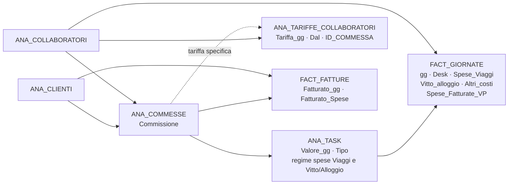

# Analisi del software Management V&P

Analisi di `management.html` e della catena front-end / back-end che lo alimenta, con
particolare attenzione a **come si forma il valore economico** di task e commesse e a
**come le spese dei collaboratori vengono rimborsate e ribaltate sui clienti**.

Documento redatto sul branch `fatture_passive_collaboratori`, verificato eseguendo il
software sull'ambiente locale con i dati reali del backup (vedi `AMBIENTE-LOCALE.md`).
I numeri dell'esempio al § 8 sono stati letti dal sistema in funzione, non ricavati
solo dalla lettura del codice.

> **Aggiornato il 04/08/2026.** Le anomalie contabili sulle spese (A2, A3) sono state
> risolte il 03/08/2026: le regole decise e la loro implementazione stanno in
> [REGOLE-SPESE.md](REGOLE-SPESE.md), il calcolo in [API/CalcoloSpese.php](../API/CalcoloSpese.php).
> I §§ 4, 5, 8 e 10 riflettono il comportamento attuale.
>
> **Aggiornato il 14/08/2026.** Il fronte fatture è stato ripreso a parte e ha una
> documentazione propria: [REGOLE-FATTURAZIONE.md](REGOLE-FATTURAZIONE.md) copre il segno
> delle note di accredito, gli storni collegati alla fattura annullata e l'allineamento
> dell'archivio ai documenti cartacei. Il § 6 di questo documento è aggiornato in coda.

---

## 1. Cosa fa e per chi

`management.html` è il portale di back-office: gestisce anagrafiche (clienti,
collaboratori, commesse, task), la consultazione delle giornate consuntivate e le
fatture attive. Il gemello `consuntivazione.html` è invece l'applicazione con cui i
collaboratori **inseriscono** le giornate: Management ne legge i risultati e li
trasforma in numeri economici.

Tre ruoli (`ANA_COLLABORATORI.Ruolo`: `Admin`, `Manager`, `User`, `Amministrazione`).
Il ruolo `User` vede solo la sezione Commesse & Task, senza alcun dato economico.

---

## 2. Architettura

### 2.1 Front-end

`management.html` è un guscio quasi vuoto: contiene i modali, il loading screen e gli
script. **Tutta l'interfaccia viene costruita in JavaScript** e iniettata in
`#appContainer` ([management.js:431](../assets/js/management.js#L431)).

Non ci sono framework né bundler: script globali caricati in ordine, classi ES6 su
`window`. L'ordine in [management.html:133-145](../management.html#L133-L145) è
significativo — `base-section.js` deve precedere le sezioni che lo estendono.

```
ManagementApp (management.js)
├── APIClient            modules/api.js          — unico punto di uscita HTTP
├── UIComponents         modules/ui-components.js — toast, modali, card statistiche
├── Utils                modules/utils.js         — formatCurrency, formatDate, ...
└── sections{}           una classe per voce di menu, tutte estendono BaseSection
    ├── commesse-task    CommesseTaskSection      ← il cuore economico
    ├── clienti          ClientiSection
    ├── collaboratori    CollaboratoriSection
    ├── fatture          FattureSection
    ├── giornate         GiornateSection
    └── statistiche      StatisticheSection       ← stub, "sezione in sviluppo"
```

**Formattazione degli importi.** Tutti i valori economici di Management passano da
`Utils.formatCurrency()`; `consuntivazione.html` non carica `utils.js` e usa il proprio
`formatItalianNumber()` ([consuntivazione.js:1766](../assets/js/consuntivazione.js#L1766)).
Entrambi dichiarano `useGrouping: 'always'`: la locale italiana ha
`minimumGroupingDigits = 2` e senza quel flag **non** separa le migliaia sui numeri di
quattro cifre (`1550,00` invece di `1.550,00`) mentre le separa da cinque in su. Corretto
il 04/08/2026, insieme a quattro importi di Consuntivazione ancora in formato inglese.
Gli export CSV usano formattatori dedicati e restano fuori da questa regola.

Il ciclo di vita di una sezione è definito da `BaseSection.initialize()`:
`showLoading() → loadData() → render() → bindEvents()`. `render()` rigenera l'HTML
dell'intera sezione come stringa: non c'è DOM diffing, e ogni interazione che cambia i
dati comporta un re-render completo.

Gli eventi usano un **unico listener delegato** su `#appContainer`
([management.js:520](../assets/js/management.js#L520)): ogni bottone dichiara
`data-action`, e l'azione non riconosciuta viene inoltrata alla sezione attiva. Le
azioni globali (navigate, logout, cambio password) sono gestite da `ManagementApp`.

### 2.2 Il caricamento dei dati: tutto in memoria, una volta sola

Questo è il punto architetturale più importante da capire:

```js
// management.js:659-663
const responses = await Promise.all([
    this.api.getCommesse({limit:1000}), this.api.getTasks({limit:1000}), this.api.getAllGiornate(),
    this.api.getClienti({limit:1000}), this.api.getCollaboratori({limit:1000}),
    this.api.getTariffe({limit:1000}), this.api.getFatture({limit:1000})
]);
```

All'avvio l'app scarica **l'intero database** in sette array in memoria
(`this.commesse`, `this.tasks`, `this.giornate`, ...). Da quel momento in poi:

- i **join** (commessa→cliente, task→commessa, giornata→task) sono fatti in JavaScript
  con `Array.find()`;
- i **filtri** per anno/mese non tornano al server: filtrano gli array già caricati;
- ogni modifica richiama `loadInitialData()`, che riscarica tutto.

Conseguenze pratiche: la reattività dei filtri è immediata, ma il costo di avvio cresce
linearmente con lo storico. Oggi sono 457 giornate e 95 task — nessun problema. Il
limite architetturale è il `limit: 1000` cablato: superate le 1000 commesse, task o
fatture i dati verrebbero **troncati in silenzio**. Solo le giornate hanno una vera
paginazione (`getAllGiornate()` cicla le pagine, [api.js:219](../assets/js/modules/api.js#L219)).

### 2.3 Back-end

PHP puro, nessun framework, PDO su MariaDB. Due punti di ingresso:

| Endpoint | Ruolo |
|---|---|
| `API/auth.php` | login, logout, check_auth, cambio/reset password (sessioni PHP) |
| `API/index.php?resource=<nome>` | router CRUD verso le classi `*API.php` |

Il routing REST "vero" (`/API/commesse/COM0001`) esiste nel codice ma è inattivo: gli
`.htaccess` in `API/` sono rinominati `.htaccess_broken` / `.htaccess_disabled`, quindi
si usa sempre la query string. `APIClient` mappa i verbi così: `update`→PUT,
`delete`→DELETE, presenza di body→POST, altrimenti GET.

Tutte le classi estendono `BaseAPI`, che implementa CRUD, paginazione, validazione e
audit (`ID_UTENTE_CREAZIONE` / `ID_UTENTE_MODIFICA` da `$_SESSION['user_id']`). Il
punto di estensione chiave è **`processRecord()`**: un hook che arricchisce ogni record
letto con dati correlati e **campi calcolati**. È lì che nasce quasi tutta la contabilità.

---

## 3. Il modello dati economico



I campi che determinano i calcoli:

**`ANA_COMMESSE`**
- `Tipo_Commessa` — `Cliente` o `Interna` (le interne non hanno cliente né responsabile).
- `Commissione` — `DECIMAL(5,4)`, frazione non percentuale: `0.27` = 27%. È la
  provvigione riconosciuta al **responsabile della commessa** (`ID_COLLABORATORE`).
- `ID_COLLABORATORE` — il responsabile, destinatario dell'accounting.

**`ANA_TASK`** — qui sta il **prezzo di vendita**
- `Tipo` — `Campo`, `Monitoraggio`, `Promo`, `Sviluppo`, `Formazione`. Determinante:
  **solo `Campo` e `Monitoraggio` generano valore**.
- `Valore_gg` — doppio significato secondo il tipo:
  - task `Campo`: **prezzo in euro** di una giornata venduta al cliente (es. 1550,00);
  - task `Monitoraggio`: **percentuale** in frazione (es. 0,10 = 10%) da applicare al
    valore Campo della commessa.
- `Spese_Comprese_Viaggi` e `Spese_Comprese_Vitto_Alloggio` (`Si`/`No`) — dal 07/08/2026
  il regime di spesa è **per categoria**: se `Si`, quella categoria è già inclusa nella
  tariffa giornaliera e **non** viene ribaltata a parte.
- `Valore_Spese_std_Viaggi` e `Valore_Spese_std_Vitto_Alloggio` — la **diaria giornaliera**
  concordata col cliente per ciascuna categoria, in alternativa alle spese reali.
  Compilabile solo se la categoria non è compresa.
- `Spese_Comprese` e `Valore_Spese_std` — i campi storici, sostituiti dai quattro sopra.
  Restano in tabella come rete di sicurezza, nessun codice li legge più.
- `gg_previste` — solo per la barra di avanzamento, non entra nei calcoli economici.

**`FACT_GIORNATE`** — il fatto generatore
- `gg` — frazione di giornata (0,5 = mezza giornata).
- `Tipo` — ricalcato su quello del task; solo `Campo` genera valore e costo.
- `Desk` (`Si`/`No`) — giornata svolta da remoto: genera valore ma **non** spese ribaltabili.
- `Viaggio` (`Si`/`No`, default `Si`) — dice se la trasferta c'è stata. Chi si ferma in loco
  fra due giornate consecutive non viaggia il secondo giorno, e il viaggio non va addebitato
  al cliente. Tocca solo il ricavo viaggi, mai il vitto/alloggio né il costo.
- `Spese_Viaggi`, `Vitto_alloggio`, `Altri_costi` — spese realmente sostenute dal collaboratore.
  `Altri_costi` segue il regime del vitto/alloggio.
- `Spese_Fatturate_VP` — quota già fatturata direttamente a V&P dal fornitore, quindi
  **non** da rimborsare al collaboratore (13 giornate su 457 la usano).
- `Confermata` — validazione della giornata; **non filtra i calcoli** (vedi § 10).

**`ANA_TARIFFE_COLLABORATORI`** — qui sta il **costo d'acquisto**
- `Tariffa_gg`, `Dal` (validità aperta, non c'è una data di fine),
  `ID_COMMESSA` (`NULL` = tariffa generale del collaboratore).

Il modello separa nettamente due mondi che non si toccano mai nella stessa tabella:
il **prezzo** vive su `ANA_TASK`, il **costo** vive su `ANA_TARIFFE_COLLABORATORI`.
La giornata è ciò che li mette in contatto.

---

## 4. Il motore di calcolo, livello per livello

Nessun valore economico è memorizzato: **tutto è ricalcolato a ogni lettura**. Non
esistono campi denormalizzati né tabelle di riepilogo. Il calcolo avviene su tre
livelli, due in PHP e uno in JavaScript.

### 4.1 Livello giornata — `GiornateAPI::processRecord()`

[GiornateAPI.php:413-493](../API/GiornateAPI.php#L413-L493). Ogni giornata letta
dall'API viene arricchita con quattro campi calcolati:

| Campo | Significato | Formula |
|---|---|---|
| `valore_calcolato` | ricavo giornate | `Tipo='Campo' ? task.Valore_gg × gg : 0` |
| `Valore_spese` | spese **ribaltate al cliente** | vedi tabella § 5.2 |
| `Costo_gg` | costo del collaboratore | `Tipo='Campo' ? tariffa_attiva × gg : 0` |
| `Costo_Spese` | spese **da rimborsare** | `(Viaggi + Vitto + Altri) − Spese_Fatturate_VP` |

Attenzione al nome di `Costo_Spese`: **non** è il costo di commessa, è il rimborso dovuto
al collaboratore. Il costo di commessa è la spesa **lorda** (`spese_totali`), perché la
quota `Spese_Fatturate_VP` è pagata con la carta di credito V&P e resta un esborso
aziendale a tutti gli effetti.

Due asimmetrie da notare:

- `Costo_gg` è calcolato per **tutte** le giornate `Campo`, comprese quelle `Desk`,
  mentre `Valore_spese` esclude le `Desk`. Corretto: il desk costa ma non produce trasferte.
- `Costo_Spese` è calcolato per **ogni** tipo di giornata, `Campo` o no. Anche una
  giornata di Formazione con spese genera un rimborso.

**La tariffa attiva** — `getTariffaAttiva()`
([GiornateAPI.php:565](../API/GiornateAPI.php#L565)) è il punto più delicato:

```sql
SELECT Tariffa_gg FROM ANA_TARIFFE_COLLABORATORI
WHERE ID_COLLABORATORE = :collaboratore
  AND Dal <= :data
  AND (ID_COMMESSA = :commessa OR ID_COMMESSA IS NULL)
ORDER BY ID_COMMESSA DESC, Dal DESC
LIMIT 1
```

L'ordinamento è la regola di business: `ID_COMMESSA DESC` mette le tariffe specifiche
di commessa prima di quelle generali (in MariaDB `NULL` ordina per ultimo in `DESC`),
poi `Dal DESC` prende la più recente tra quelle già in vigore. Quindi:
**tariffa di commessa > tariffa generale**, e a parità di specificità vince la più recente.
Non esiste una data di fine validità: una tariffa resta valida finché non ne compare
una più recente.

Verificato sui dati reali: CONS002 ha tariffa generale 800 e tariffa 850 su COM0001;
le sue giornate su COM0001 vengono valorizzate 850/gg.

### 4.2 Livello task — `TaskAPI::processRecord()`

[TaskAPI.php:228-281](../API/TaskAPI.php#L228-L281). Aggiunge `valore_gg_maturato`,
`valore_spese_maturato` e `valore_tot_maturato`, cioè **quanto quel task ha prodotto
finora in termini di ricavo**.

**Task `Campo`** ([TaskAPI.php `calcolaValoreGg`](../API/TaskAPI.php)):

```
valore_gg_maturato = Σ(gg delle giornate Campo) × task.Valore_gg
```

Se `Valore_gg` è 0 o nullo, il codice prevede un fallback sulle tariffe dei
collaboratori — che però **non funziona** (vedi § 10, anomalia A1).

**Task `Monitoraggio`** ([TaskAPI.php:366-432](../API/TaskAPI.php#L366-L432)) — è la
parte più articolata. Il monitoraggio è un compenso di coordinamento, calcolato come
percentuale del lavoro di campo prodotto **da tutta la commessa**:

```
valore = task.Valore_gg (percentuale) × Σ(gg × Valore_gg) di TUTTI gli altri task Campo della commessa
```

con due regole aggiuntive:

1. **Finestra temporale** — conta solo le giornate comprese tra `Data_Apertura_Task` e
   `Data_Fine` del task di monitoraggio. Permette di avvicendare responsabili nel tempo.
2. **Anti-duplicazione** — se più task di monitoraggio sono aperti sulla stessa commessa,
   valorizza **solo il più vecchio**; gli altri restituiscono 0 finché non vengono chiusi.
   Il criterio è `Data_Apertura_Task` crescente, con `ID_TASK` come spareggio. I task
   già `Chiuso`/`Archiviato` sono esclusi dal confronto e mantengono il proprio valore
   storico.

**Spese del task** (`calcolaValoreSpese`, delegato a `CalcoloSpese::ricavoAggregato()`):
per ciascuna delle due categorie, compresa → 0; con diaria → **la diaria per ogni giornata
di campo addebitabile**; altrimenti la somma delle spese reali di quella categoria. I
viaggi contano solo le giornate con `Viaggio = 'Si'`, quindi `aggregaSpeseTask()`
restituisce due conteggi distinti (`n_addebitabili` e `n_con_viaggio`) oltre alle due
somme. Dal 03/08/2026 `TaskAPI` espone anche `costo_spese_maturato`, l'esborso lordo
del task. Vedi [REGOLE-SPESE.md](REGOLE-SPESE.md).

**Filtri di periodo** — se la richiesta porta `?anno=` o `?anno_mese=`, `TaskAPI`
calcola *anche* le varianti `_filtrato` dei tre valori. La UI di Management però non
passa mai questi parametri: filtra lato client. Sono campi pronti ma inutilizzati.

### 4.3 Livello commessa — front-end

Qui il calcolo torna in JavaScript, in
[`createCommessaCard()`](../assets/js/modules/sections/commesse-task-section.js#L123-L240).
È la schermata che l'utente vede per prima, con i badge colorati in testata:

```js
sommaValoreCampo        = Σ task.valore_gg_maturato        dei task Campo
sommaValoreMonitoraggio = Σ task.valore_gg_maturato        dei task Monitoraggio
valoreComplessivoLavori = sommaValoreCampo + sommaValoreMonitoraggio
valoreComplessivoSpese  = Σ task.valore_spese_maturato     (tutti i task)
valoreTotale            = valoreComplessivoLavori + valoreComplessivoSpese   ← badge nero

costoCampoDalleGiornate = Σ (giornata.Costo_gg + giornata.spese_totali)  sui task Campo
                                                 └─ esborso lordo, non il prezzo di vendita
costoMonitoraggio       = Σ task.valore_gg_maturato dei task Monitoraggio
costo_totale_attivita   = costoCampoDalleGiornate + costoMonitoraggio        ← badge grigio

costoAccounting         = sommaValoreCampo × commessa.Commissione
margineAssoluto         = valoreTotale − costo_totale_attivita − costoAccounting
marginalita %           = margineAssoluto / valoreTotale × 100               ← badge azzurro
```

**La base dell'accounting è il solo valore Campo**, cioè il maturato delle giornate
vendute al cliente. Ne restano fuori due voci:

- il **ricavo spese** (`valore_spese_maturato`), sia a diaria sia a consuntivo — la
  provvigione non si paga sul ribaltamento delle trasferte;
- il valore dei task di **Monitoraggio**, che è già un compenso a sé riconosciuto al
  coordinatore.

Esempio su COM2025018 (LACTALIS STAB CORTEOLONA SVILUPPO 2026): valore lavori 31.968,75 €
di cui 2.906,25 € di monitoraggio, più 1.155,00 € di spese, per un valore totale di
33.123,75 €. La base è **29.062,50 €** e con `Commissione` 0,27 l'accounting vale
**7.846,88 €** — non 8.943,41 € (sul totale) né 8.631,56 € (col monitoraggio).

La regola è identica nelle tre implementazioni: card di commessa, totali della barra
statistiche ([:1185-1189](../assets/js/modules/sections/commesse-task-section.js#L1185-L1189))
e maturato mensile ([CommesseAPI.php:857](../API/CommesseAPI.php#L857)), che moltiplica
`valore_campo` — già al netto di monitoraggio e spese.

#### Cosa comprende «Costo totale attività»

È il badge grigio della testata di commessa, e comprende **tre** voci:

| Componente | Formula |
|---|---|
| Costo consulenti | Σ `giornata.Costo_gg` — tariffa attiva × gg, sulle giornate dei task `Campo` |
| Costo spese | Σ `giornata.spese_totali` — viaggi + vitto/alloggio + altri, **al lordo** |
| Costo monitoraggio | Σ `task.valore_gg_maturato` dei task `Monitoraggio` |

**Il costo accounting non è compreso**: è una voce a sé, mostrata nell'intestazione della
commessa e sottratta separatamente nel calcolo del margine.

Le spese qui sono lorde, quindi includono la quota `Spese_Fatturate_VP` che il
collaboratore non fattura perché pagata con la carta aziendale. È la differenza rispetto
alla sezione Collaboratori (§ 5.3), che lavora sul netto.

Dettaglio minore: le spese vengono sommate su **tutte** le giornate dei task `Campo`,
anche su una giornata che non sia essa stessa di tipo `Campo`; il `Costo_gg` invece è
zero per quelle. È coerente — una spesa sostenuta è un esborso a prescindere dal tipo
di giornata.

La struttura del conto economico di commessa è quindi:

| Voce | Natura |
|---|---|
| **+ Valore lavori** | giornate Campo vendute + quota monitoraggio |
| **+ Valore spese** | spese ribaltate al cliente |
| **− Costo attività** | tariffe dei collaboratori + **esborso reale** delle spese + compenso monitoraggio |
| **− Costo accounting** | provvigione al responsabile: `valore Campo × Commissione`, **al netto di spese e monitoraggio** |
| **= Margine** | |

Il **monitoraggio compare due volte**, come ricavo e come costo: il cliente lo paga e
il coordinatore lo incassa, quindi a margine è neutro per costruzione. **Le spese no.**
Fino al 03/08/2026 lo erano anche loro — il costo usava lo stesso `Valore_spese` del
ricavo, quindi lo spread era zero per costruzione (§ 10, A2). Oggi il ricavo è il prezzo
concordato (diaria o consuntivo) e il costo è l'esborso reale: **il margine si forma in
tre punti**, lo spread sulle giornate, lo spread sulle spese, meno la provvigione di
accounting. Nel regime a consuntivo lo spread sulle spese resta zero, ma è una
conseguenza dei dati, non della formula.

Nota tecnica: il costo usa `giornata.Costo_gg` e `giornata.spese_totali`, campi calcolati
da `GiornateAPI`, mentre il ricavo usa `task.valore_*_maturato`, calcolato da `TaskAPI`.
Sono due catene indipendenti, ma dal 03/08/2026 condividono le regole sulle spese
tramite [`CalcoloSpese`](../API/CalcoloSpese.php): prima divergevano.

#### Come leggere le etichette a schermo

Le diciture della card del task sono state riviste il 04/08/2026 per non chiamare
«spese» cose diverse:

| Etichetta | Grandezza |
|---|---|
| `Costo Spese A/R` | esborso viaggi (era «Spese A/R») |
| `Costo Vitto/Alloggio + Altre` | esborso vitto, alloggio e altro (era «Vitto/Alloggio + Altre») |
| `Val. Spese` | **ricavo**, prezzo addebitato al cliente (era «Tot Spese») |

Il modale «Visualizza *nn* Date» espone le stesse grandezze riga per riga: `Costo Viaggi`,
`Costo Vitto/Alloggio + Altre`, `Valore Spese`, `Valore gg`. La colonna `Costo_gg` è stata
tolta — il costo del collaboratore si legge nella sezione Collaboratori (§ 5.3). Su un
task a diaria le colonne di costo e quella di ricavo divergono per costruzione, e la
differenza è ora leggibile giornata per giornata.

### 4.4 Livello mensile — un motore parallelo, non usato

`CommesseAPI::getMaturatoMensile()`
([CommesseAPI.php:579-910](../API/CommesseAPI.php#L579-L910)), raggiungibile con
`?resource=commesse&action=maturato[&id=COM0001]`, produce lo stesso conto economico
**spaccato per mese**: `valore_campo`, `valore_monitoraggio`, `valore_spese`,
`Costo_gg`, `Costo_Spese`, `Costo_TOT`, `costo_accounting`, `margine`.

**Nessuna parte del front-end lo chiama.** È un endpoint completo e funzionante ma
orfano — utile se in futuro si vuole una vista mensile o l'export di un conto economico
per periodo, ma oggi è codice che nessuno esercita (e che quindi nessuno verifica).

Sulle spese è ora allineato alla card: dal 03/08/2026 applica la diaria per giornata
anziché una volta al mese, `Costo_TOT` usa l'esborso reale e c'è un `Costo_Spese`
mensile. Resta **una** differenza rispetto al front-end, da tenere presente se lo si
adotta: usa **sempre** la tariffa del collaboratore che ha svolto la giornata, ignorando
`Valore_gg` del task ([CommesseAPI.php:872-874](../API/CommesseAPI.php#L872-L874)).

---

## 5. Spese dei collaboratori e ribaltamento al cliente

È la parte con più regole implicite, quindi la tratto a parte.

### 5.1 Le tre facce della stessa spesa

Una spesa sostenuta su una giornata esiste nel sistema in **tre importi distinti**,
che coincidono solo nel caso più semplice:

| | Campo | Chi lo sostiene | Dove si vede |
|---|---|---|---|
| **Spesa sostenuta** | `Spese_Viaggi + Vitto_alloggio + Altri_costi` | V&P, comunque | `spese_totali` — è il **costo di commessa** |
| **Spesa rimborsata** | `Costo_Spese` = sostenuta − `Spese_Fatturate_VP` | V&P → collaboratore | sezione Collaboratori, consuntivazione |
| **Spesa ribaltata** | `Valore_spese` | il cliente → V&P | valore commessa, sezione Clienti |

`Spese_Fatturate_VP` è la quota che il fornitore ha già fatturato direttamente a V&P
(tipicamente un hotel o un treno pagato dall'azienda): il collaboratore l'ha dichiarata
ma non deve essere rimborsato per quella parte. **Non riduce il costo di commessa**: V&P
quella spesa l'ha sostenuta comunque, semplicemente con la carta aziendale anziché per
rimborso.

### 5.2 Come si determina la spesa ribaltata al cliente

Logica in [CalcoloSpese](../API/CalcoloSpese.php), applicata da `GiornateAPI`. Dal
07/08/2026 le due categorie si valutano separatamente e si sommano: `Valore_spese` è la
somma di `Valore_spese_viaggi` e `Valore_spese_vitto`, entrambi esposti dall'API.

**Viaggi** — `CalcoloSpese::ricavoViaggiGiornata()`, in cascata:

| Condizione | `Valore_spese_viaggi` |
|---|---|
| Giornata non di tipo `Campo`, o `Desk = 'Si'` | **0** |
| Giornata con `Viaggio = 'No'` | **0** — nessuna trasferta quel giorno |
| Task con `Spese_Comprese_Viaggi = 'Si'` | **0** — già dentro la tariffa giornaliera |
| Task con `Valore_Spese_std_Viaggi > 0` | **la diaria viaggi**, intera su ogni giornata di campo e indipendente dalle spese reali (anche sulle mezze giornate: la trasferta c'è comunque) |
| Altrimenti | **`Spese_Viaggi` reali** (al lordo di `Spese_Fatturate_VP`) |

**Vitto/alloggio + altre** — `CalcoloSpese::ricavoVittoGiornata()`:

| Condizione | `Valore_spese_vitto` |
|---|---|
| Giornata non di tipo `Campo`, o `Desk = 'Si'` | **0** |
| Task con `Spese_Comprese_Vitto_Alloggio = 'Si'` | **0** |
| Task con `Valore_Spese_std_Vitto_Alloggio > 0` | **la diaria V/A**, intera su ogni giornata di campo |
| Altrimenti | **`Vitto_alloggio + Altri_costi` reali** |

Il flag `Viaggio` non compare in questa seconda tabella: chi si ferma mangia e dorme comunque.

Il **costo** segue una regola sola, senza eccezioni: `Spese_Viaggi + Vitto_alloggio +
Altri_costi`, in ogni regime e a prescindere dal flag `Viaggio`. Non dipende da come la
spesa è stata venduta.

Tre osservazioni che contano nella pratica:

1. **Con `Valore_Spese_std` il rischio spese passa a V&P.** Se il collaboratore spende
   più della diaria, la differenza è margine perso; se spende meno, è margine guadagnato.
   Sui dati reali 26 task usano la diaria, e su parecchi copre meno della metà della
   trasferta (TAS00083: 935 € incassati contro 2.069 € sostenuti). Dal 03/08/2026 questo
   scarto **si vede nel margine di commessa**; prima no.
2. **Con `Spese_Comprese = 'Si'` il cliente non paga nulla di separato, ma V&P sostiene
   comunque la spesa.** Quel costo entra nel conto economico di commessa come tutti gli
   altri (era l'anomalia A3, risolta il 03/08/2026). 33 task sono in questa configurazione.
3. **La spesa ribaltata è calcolata al lordo di `Spese_Fatturate_VP`.** Se un hotel da
   200 € è stato fatturato direttamente a V&P, il cliente viene comunque addebitato di
   200 € (giusto: è un costo sostenuto per lui) e il collaboratore non riceve rimborso
   (giusto: non l'ha pagato lui). Le due grandezze sono correttamente indipendenti.

### 5.3 Il costo del collaboratore

La sezione **Collaboratori** presenta, per ciascuno, tre grandezze distinte
([collaboratori-section.js:1359-1361](../assets/js/modules/sections/collaboratori-section.js#L1359-L1361)):

- **Rimborso attività** = Σ (`Costo_gg` + `Costo_Spese`) sulle sue giornate — quanto
  V&P gli deve per giornate lavorate e spese anticipate;
- **Valore Monitoraggio** = per i task di monitoraggio a lui assegnati, la percentuale
  applicata al valore Campo della commessa;
- **Accounting** = per le commesse di cui è **responsabile**, `Σ (valore_calcolato × Commissione)`
  sulle giornate dei soli task `Campo`
  ([:1180-1195](../assets/js/modules/sections/collaboratori-section.js#L1180-L1195)) — stessa
  base della card di commessa, quindi senza spese né monitoraggio.

Le tre voci hanno origini diverse e si sommano: un collaboratore senior può percepire
contemporaneamente la tariffa giornaliera per il lavoro svolto, la percentuale di
monitoraggio per il coordinamento e la provvigione di accounting per aver portato la
commessa. Sono i tre modi in cui il sistema riconosce valore a una persona, e sono tutti
calcolati a partire dallo stesso fatto: le giornate consuntivate.

Il dettaglio è navigabile per mese e per commessa (accordion nella card del collaboratore),
ed esportabile in CSV.

#### A cosa serve questa pagina: quanto il collaboratore deve fatturare

È la chiave di lettura dell'intera sezione, e spiega perché i suoi numeri **non** coincidono
con quelli del conto economico di commessa. Qui si guarda il **debito verso la persona**,
quindi le spese sono al netto di `Spese_Fatturate_VP`: quella quota il collaboratore non
l'ha anticipata, quindi non la fattura. Nel § 4.3 invece il costo è la spesa **lorda**,
perché V&P quell'esborso lo sostiene comunque. Le due viste sono volutamente diverse.

Lo scarto riguarda oggi due sole persone, per 1.415,00 € complessivi: Giorgio Troni
(1.061,00 €) e Francesco Silvestri (354,00 €). Per tutti gli altri quanto fatturano e
quanto costano coincidono.

L'export CSV ([collaboratori-section.js:143-160](../assets/js/modules/sections/collaboratori-section.js#L143-L160))
ha 14 colonne; le sei economiche sono:

| Colonna | Contenuto |
|---|---|
| `Rimborso_Attivita_Giornate` | Σ `Costo_gg` — solo la tariffa per le giornate lavorate |
| `Rimborso_Spese` | Σ `Costo_Spese` — solo le spese anticipate, **al netto** di `Spese_Fatturate_VP` |
| `Rimborso_Totale` | somma delle due |
| `Valore_Monitoraggio` | compenso di coordinamento |
| `Accounting` | provvigione da responsabile di commessa |
| `Totale` | `Rimborso_Totale + Valore_Monitoraggio + Accounting` — **quanto il collaboratore fattura** |

La componente giornate è calcolata per differenza dal totale, così le tre colonne di
rimborso quadrano sempre anche quando scatta il fallback sul calcolo delle spese.

`Totale` mescola compensi e restituzione di anticipi: il solo guadagno è
`Totale − Rimborso_Spese`, ed è il motivo per cui le due componenti stanno separate.
Il costo aziendale pieno sarebbe invece `Totale + Spese_Fatturate_VP`, colonna che oggi
non esiste perché la pagina risponde alla domanda «quanto mi fattura», non «quanto mi costa».

---

## 6. Il ribaltamento al cliente: maturato vs fatturato

Vanno tenuti distinti due concetti che il software **non collega mai automaticamente**.

**Il maturato** è quanto la commessa ha prodotto, ricalcolato dalle giornate. La sezione
**Clienti** lo mostra aggregato per cliente
([clienti-section.js:169-225](../assets/js/modules/sections/clienti-section.js#L169-L225)),
ricalcolandolo interamente lato browser:

```
maturato cliente = Σ commesse del cliente di:
      Σ giornate.valore_calcolato      (task Campo, nel periodo filtrato)
    + Σ giornate.Valore_spese          (nel periodo filtrato)
    + valore Campo × Valore_gg         (per ogni task Monitoraggio della commessa)
```

**Il fatturato** è `FACT_FATTURE`, e viene **inserito a mano**. Nella maschera fattura
([fatture-section.js:640-642](../assets/js/modules/sections/fatture-section.js#L640-L642))
l'operatore digita `Fatturato_gg` (importo giornate) e `Fatturato_Spese` (importo spese);
`Fatturato_TOT` è l'unico automatismo, la somma dei due. Nulla viene precompilato dal
maturato, nulla viene marcato come "già fatturato", nessuno scarto viene evidenziato.

Il risultato è che **il ribaltamento economico sul cliente è calcolato dal sistema ma
eseguito dall'operatore**. Management fornisce il numero (il maturato per commessa e per
periodo) e tiene la contabilità dell'incassato (`Valore_Pagato`, `Scadenza_Pagamento`,
stato pagamento con scadute/parziali), ma la riconciliazione fra i due mondi — "di questa
commessa ho maturato X e fatturato Y" — non esiste in nessuna schermata. È l'assenza
funzionale più rilevante emersa dall'analisi, e la ragione per cui la sezione Statistiche
è ancora uno stub.

La struttura dati per farlo c'è già: `FACT_FATTURE` ha `ID_COMMESSA`, e la separazione
`Fatturato_gg` / `Fatturato_Spese` rispecchia esattamente la separazione
`valore lavori` / `valore spese` del maturato.

> **Aggiornamento 14/08/2026.** La riconciliazione resta da fare, ma il quadro è cambiato in
> due punti. Statistiche non è più uno stub: ospita il registro attività
> ([STATISTICHE.md](STATISTICHE.md)). E l'archivio fatture è stato riallineato ai documenti
> cartacei ([REGOLE-FATTURAZIONE.md](REGOLE-FATTURAZIONE.md) §§ 5-6), il che ha portato a
> galla l'ostacolo vero: `ID_COMMESSA` è valorizzato solo su 3 delle 40 fatture 2026, quindi
> oggi il confronto per commessa non sarebbe possibile nemmeno volendo. Dai PDF la commessa
> non si ricava: serve una mappatura fatta a mano.

---

## 7. Ruoli, permessi e sicurezza

Il ruolo è deciso al login e conservato in `$_SESSION['user_role']`.

**Lato front-end** il ruolo `User` non vede le voci di menu diverse da Commesse & Task
([management.js:436-442](../assets/js/management.js#L436-L442)) e, dentro quella
sezione, il flag `isUser` nasconde tutti i badge economici e i pulsanti di modifica.

**Lato back-end** l'unico filtro effettivo è in
[CommesseAPI.php:386-393](../API/CommesseAPI.php#L386-L393): se il ruolo è `User`, le
commesse vengono limitate a quelle presenti in `ANA_COMMESSE_VISIBILITA` per
quell'utente. `TaskAPI` e `GiornateAPI` non applicano alcun filtro equivalente.

**`API/index.php` verifica la sessione all'ingresso** ([index.php:66-77](../API/index.php#L66-L77)):
nessuna risorsa del router è pubblica, e senza sessione la richiesta si ferma con
`401 Autenticazione richiesta` prima del routing e prima di qualsiasi query. `auth.php`
resta l'unico endpoint raggiungibile senza sessione. Stesso controllo su
`ConsuntivazioneAPI::serveImage()`, che serve gli allegati.

Va tenuta ferma la distinzione fra i due livelli: **il gate su `index.php` è il controllo
di accesso** (chi sei), mentre il filtro per ruolo decide **cosa puoi vedere** una volta
entrato. Il secondo non sostituisce il primo.

> Storicamente non era così: fino al 31/07/2026 il router non effettuava alcun controllo
> di sessione e l'intero database era leggibile e scrivibile senza login. Vedi § 10, S1.

### 7.2 Autorizzazione per ruolo

`Admin`, `Manager` e `Amministrazione` non hanno restrizioni sulle API. **`User` è l'unico
ruolo limitato**: è il collaboratore che consuntiva, e in Management vede la sola sezione
Commesse & Task senza alcun dato economico.

Le restrizioni vivono in `BaseAPI` ([BaseAPI.php](../API/BaseAPI.php)) e sono tre, così
che una risorsa nuova nasca limitata invece di dipendere da chi la scrive:

| Punto di estensione | Cosa decide |
|---|---|
| `getRoleScopeClause()` | **quali righe** — condizione SQL aggiunta a ogni `SELECT`, elenco e singolo record |
| `getRestrictedUserFields()` | **quali colonne** — allowlist applicata dopo `processRecord()` |
| `assertWriteAllowed()` | **la scrittura è vietata** — `403` su POST/PUT/DELETE |

Il perno è `ANA_COMMESSE_VISIBILITA`: la visibilità è concessa a livello di **commessa** e
da lì discende su task e giornate. Risorsa per risorsa, un utente `User` vede:

| Risorsa | Righe | Colonne escluse |
|---|---|---|
| `commesse` | solo quelle assegnate | `Commissione` |
| `task` | dei suoi commesse | `Valore_gg`, i quattro campi di regime spese, valori maturati |
| `giornate` | dei task dei suoi commesse | spese, `Costo_gg`, `Costo_Spese`, `Valore_spese`, `valore_calcolato`, `task_info` |
| `clienti` | dei suoi commesse | tutto tranne `ID_CLIENTE` e `Cliente` |
| `collaboratori` | sé stesso + responsabili e assegnatari dei suoi commesse | tutto tranne `ID_COLLABORATORE` e `Collaboratore` |
| `tariffe` | solo la propria | — |
| `fatture` | nessuna | — |

Due dettagli che non si deducono leggendo il codice in fretta:

- **`Costo_gg` è escluso perché è una tariffa travestita.** Vale `tariffa × giorni`: farlo
  passare avrebbe reso deducibili i compensi dei colleghi, vanificando la restrizione su
  `tariffe`. Stesso motivo per `task_info` nelle giornate, che porta con sé `Valore_gg`.
- **Gli endpoint con SQL proprio non passano dal filtro** e vanno chiusi a mano:
  `?resource=commesse&action=maturato` e `?resource=fatture_collaboratori&action=summary`
  rispondono `403` al ruolo `User`. È il motivo per cui esiste `assertNotRestrictedUser()`
  come guard esplicito.

Sul singolo record la restrizione risponde `404`, non `403`: non si conferma l'esistenza
di ciò che non si può vedere.

---

## 8. Esempio numerico completo — commessa COM0001

Numeri letti dall'ambiente locale sui dati reali, per rendere concreto tutto quanto sopra.

**Commessa** CALVI SVIL MANAGERIALITA' — cliente CLI0003, responsabile CONS001,
`Commissione` 0,27, stato Sospesa.

**Task:**

| Task | Tipo | Valore_gg | Spese comprese | gg | valore_gg_maturato |
|---|---|---|---|---|---|
| TAS00001 | Campo | 1.550,00 € | Si | 5,5 | 8.525,00 € |
| TAS00002 | Campo | 1.450,00 € | Si | 29,0 | 42.050,00 € |
| TAS00037 | Campo | 1.450,00 € | Si | 4,0 | 5.800,00 € |
| TAS00003 | Monitoraggio | 0,10 (=10%) | Si | — | 5.637,50 € |

Verifica del monitoraggio: valore Campo = 8.525 + 42.050 + 5.800 = **56.375,00 €**;
10% = **5.637,50 €**. ✔

**Conto economico:**

```
  Valore lavori     56.375,00 (Campo) + 5.637,50 (Monitoraggio)  =  62.012,50
  Valore spese                                                   =       0,00   (spese comprese su tutti i task)
  ─────────────────────────────────────────────────────────────────────────────
  VALORE TOTALE                                                  =  62.012,50

  Costo giornate    Σ Costo_gg (tariffe dei collaboratori)       =  34.750,00
  Costo spese       Σ (Viaggi + Vitto + Altri), esborso reale    =     175,00
  Costo monitoraggio                                             =   5.637,50
  ─────────────────────────────────────────────────────────────────────────────
  COSTO ATTIVITÀ                                                 =  40.562,50

  COSTO ACCOUNTING  56.375,00 × 0,27                             =  15.221,25
  ─────────────────────────────────────────────────────────────────────────────
  MARGINE           62.012,50 − 40.562,50 − 15.221,25            =   6.228,75   (10,0%)
```

Si legge bene la struttura: su 62.012 € di valore, 34.750 € vanno ai collaboratori come
tariffe, 5.637 € al coordinatore, 15.221 € al responsabile come provvigione, e restano
6.228 € (10,0%) all'azienda.

I 175,00 € di spese sono un caso di scuola del regime `Spese_Comprese = 'Si'`: il cliente
non le paga a parte (ricavo spese 0), ma V&P le sostiene, quindi stanno a costo e basta.
Fino al 03/08/2026 non comparivano in nessuna riga e il margine risultava 6.403,75 €
(§ 10, anomalia A3).

---

## 9. Mappa dei file

| File | Contenuto |
|---|---|
| [management.html](../management.html) | guscio: modali, script, loading screen |
| [assets/js/management.js](../assets/js/management.js) | `ManagementApp`: auth, layout, routing, caricamento dati |
| [assets/js/modules/api.js](../assets/js/modules/api.js) | `APIClient`: unico punto di uscita HTTP |
| [assets/js/modules/utils.js](../assets/js/modules/utils.js) | `formatCurrency()`: **unico** punto di formattazione degli importi di Management |
| [assets/js/modules/sections/commesse-task-section.js](../assets/js/modules/sections/commesse-task-section.js) | **conto economico di commessa**, card task, export |
| [assets/js/modules/sections/collaboratori-section.js](../assets/js/modules/sections/collaboratori-section.js) | rimborsi, monitoraggio, accounting per collaboratore |
| [assets/js/modules/sections/clienti-section.js](../assets/js/modules/sections/clienti-section.js) | maturato per cliente |
| [assets/js/modules/sections/fatture-section.js](../assets/js/modules/sections/fatture-section.js) | fatture attive, incassi, scadenzario |
| [assets/js/modules/sections/giornate-section.js](../assets/js/modules/sections/giornate-section.js) | consultazione giornate consuntivate |
| [API/index.php](../API/index.php) | router `?resource=` |
| [API/BaseAPI.php](../API/BaseAPI.php) | CRUD, paginazione, audit, hook `processRecord()` |
| [API/CalcoloSpese.php](../API/CalcoloSpese.php) | **regole delle spese in un punto solo**: ricavo (diaria/consuntivo) e costo (esborso lordo) |
| [API/GiornateAPI.php](../API/GiornateAPI.php) | **`valore_calcolato`, `Valore_spese`, `Costo_gg`, `Costo_Spese`, tariffa attiva** |
| [API/TaskAPI.php](../API/TaskAPI.php) | **valori maturati, logica monitoraggio** |
| [API/CommesseAPI.php](../API/CommesseAPI.php) | commesse, visibilità per ruolo, maturato mensile (non usato) |
| [DB/critical/setup.php](../DB/critical/setup.php) | schema di riferimento delle tabelle |

---

## 10. Anomalie e punti d'attenzione

Emersi durante l'analisi, verificati sull'ambiente locale. Ordinati per impatto.
Le voci risolte restano qui con la data: servono a capire perché i numeri storici
non coincidono con quelli di oggi.

### S1 — Le API non richiedevano autenticazione · *sicurezza, alto* · **RISOLTO il 31/07/2026**

`API/index.php` non controllava la sessione. Verificato prima del fix: senza login,
`GET /API/index.php?resource=clienti` restituiva l'anagrafica completa; lo stesso per
collaboratori (con email e ruoli), tariffe, giornate e fatture. Anche POST/PUT/DELETE
erano aperti — una POST su `?resource=clienti` creava davvero il record. Il filtro per
ruolo `User` su `ANA_COMMESSE_VISIBILITA` era aggirabile semplicemente non autenticandosi.
Aperta anche `ConsuntivazioneAPI.php?action=serve_image`, unico metodo della classe senza
guard: gli allegati hanno un id progressivo, quindi bastava enumerarli.

Chiuso con un controllo di sessione in testa a `index.php`, prima del routing, e con lo
stesso guard su `serveImage()`. Entrambi rispondono `401` senza distinguere fra sessione
assente, scaduta o risorsa inesistente.

### S2 — L'autorizzazione per ruolo era parziale · *sicurezza, medio* · **RISOLTO il 31/07/2026**

Chiuso l'accesso anonimo (S1), restava il livello sopra: fra utenti autenticati il filtro
per ruolo era applicato **solo** da `CommesseAPI`. Un utente `User` — che nel front-end
vede la sola sezione Commesse & Task senza alcun dato economico — interrogando
direttamente `?resource=giornate` otteneva le giornate di **tutti** i collaboratori, da
`?resource=tariffe` i compensi di tutti, e da `?resource=commesse&action=maturato` il
conto economico mensile di qualsiasi commessa.

Chiuso portando la logica in `BaseAPI`, in tre punti di estensione descritti al § 7.2, in
modo che una risorsa nuova nasca limitata invece di dipendere da chi la scrive.

### A1 — Il fallback sulle tariffe è codice morto, e il problema vero sta nei dati · *presidiato il 31/07/2026*

Quando `ANA_TASK.Valore_gg` è 0 o nullo, `TaskAPI` dovrebbe ripiegare sulle tariffe dei
collaboratori. La query di fallback (in `calcolaValoreGg()` e nella gemella filtrata)
referenzia però una colonna `ANA_TARIFFE_COLLABORATORI.Al` **che non esiste** — lo schema
ha solo `Dal`, perché le tariffe hanno validità aperta. La query solleva
`Unknown column 't.Al' in 'ON'`, il `catch` lo assorbe e la funzione restituisce 0: il
fallback non ha mai funzionato dal giorno in cui è stato scritto.

**Non è però la causa di margini sbagliati oggi.** I due task `Campo` senza prezzo che
hanno giornate consuntivate — `TAS00055` e `TAS00106` — stanno entrambi su `COM2025001
"Sviluppo"`, una commessa **Interna**: lì l'assenza di prezzo è corretta, il lavoro
interno non si vende ed è puro costo. Far funzionare il fallback sarebbe anzi **dannoso**,
perché valorizzerebbe quelle giornate alla tariffa di costo del collaboratore, inventando
ricavo su un progetto interno e facendolo apparire in pareggio. C'è del resto un problema
concettuale a monte: usare la tariffa di costo come prezzo di vendita produce margine zero
per costruzione, e non è un ripiego sensato in nessuno scenario.

Il rischio reale è **il dato mancante su una commessa cliente**: `TAS00086 "POLMONE"`, di
tipo `Campo` e `In corso` su `COM2025013 LACTALIS`, non ha `Valore_gg`. Oggi non produce
danni perché non ha giornate, ma appena qualcuno ci consuntiva sopra quelle giornate
generano costo e ricavo zero, e il margine della commessa è sbagliato senza alcun avviso.

**Presidiato**, su indicazione dell'utente, impedendo il dato sbagliato invece di
inventarlo: un task `Campo` su commessa `Cliente` non può restare `In corso` senza
`Valore_gg`. Il vincolo è in `TaskAPI` su create e update, con riscontro immediato nel
form e un avviso sulle schede dei task già esistenti che ne sono privi. Le commesse
`Interna` sono escluse, e lo stato `Sospeso` resta disponibile come via d'uscita per i
task storici incompleti.

Il fallback morto è stato **rimosso**, non riparato: nessun cambiamento di
comportamento, restituiva 0 e ora restituisce 0 esplicitamente. Se in futuro qualcuno
pensasse di reintrodurlo aggiungendo la colonna `Al`, la nota nel codice spiega perché
non va fatto — valorizzerebbe le giornate alla tariffa di costo, inventando ricavo sulle
commesse interne e producendo margine zero per costruzione su quelle cliente.

### A2 — Le spese forfettarie erano contate una volta per task come ricavo, una volta per giornata come costo · *contabile, medio* · **RISOLTO il 03/08/2026**

Con `Valore_Spese_std > 0`, `TaskAPI::calcolaValoreSpese()` restituiva **il forfait una
sola volta per task**, mentre `GiornateAPI` assegnava **il forfait intero a ogni giornata**.
La card di commessa usava entrambe le fonti: il ricavo spese da `task.valore_spese_maturato`,
il costo spese da `Σ giornata.Valore_spese`.

Verificato su TAS00083 (forfait 55 €, 17 giornate): `valore_spese_maturato = 55,00 €`
lato task, `Σ Valore_spese = 935,00 €` lato giornate. La stessa voce entrava nel conto
economico come 55 € di ricavo e 935 € di costo — 880 € di margine negativo fittizio.
Sui 26 task a diaria lo scarto complessivo era di 7.460 €.

C'erano **tre interpretazioni diverse dello stesso dato**: per task (card, ricavo), per
giornata (sezione Clienti e card, costo), per mese (`getMaturatoMensile()`).

**Risoluzione.** Il 02/08/2026 è stato deciso che `Valore_Spese_std` è una **diaria
giornaliera**; le letture per task e per mese sono state eliminate e le regole
accentrate in [`CalcoloSpese`](../API/CalcoloSpese.php). Le tre fonti ora concordano.
16 commesse hanno cambiato margine. Dettaglio in [REGOLE-SPESE.md](REGOLE-SPESE.md).

Coda della stessa anomalia, **corretta il 04/08/2026**: l'export CSV delle giornate era
rimasto fuori dall'allineamento e scriveva l'esborso nella colonna `Valore Spese`
(2.069 € su TAS00083 invece di 935 €). Ora legge `Valore_spese` dall'API ed espone
l'esborso in una colonna `Costo Spese` separata.

### A3 — Le spese sui task `Spese_Comprese='Si'` sparivano dal costo di commessa · *contabile, basso-medio* · **RISOLTO il 03/08/2026**

Il costo di commessa sommava `Costo_gg + Valore_spese` (la spesa **ribaltata**), non
l'esborso. Quando `Spese_Comprese = 'Si'`, `Valore_spese` è 0 per definizione, ma V&P la
spesa la sostiene comunque: quel costo non compariva da nessuna parte nel conto economico
della commessa, che risultava più redditizia del reale.

Su COM0001 erano 175 €; sul totale del database le spese registrate sono 12.255,62 €, di
cui 1.415,00 € già fatturate a V&P.

**Risoluzione.** Il costo ora è l'esborso lordo in **ogni** regime, senza eccezioni:
né `Spese_Comprese = 'Si'` né la presenza di una diaria lo riducono. Il commento nel
codice che imponeva `Valore_spese` come costo è stato rimosso e sostituito con il
rimando a [REGOLE-SPESE.md](REGOLE-SPESE.md).

### A4 — La colonna `Totale_Giornate` dell'export commesse è sempre 0 · *cosmetico*

`groupTasksByCommessa()` rimuove deliberatamente `gg_effettuate` dai task
([commesse-task-section.js:1244](../assets/js/modules/sections/commesse-task-section.js#L1244))
per forzare il ricalcolo Campo-only nei badge. L'export però legge proprio quel campo
([riga 1284](../assets/js/modules/sections/commesse-task-section.js#L1284)), che a quel
punto è `undefined`, e scrive 0. La colonna adiacente `Giornate_Campo`, calcolata dalle
giornate, è corretta.

### A5 — Il flag `Confermata` non influenza alcun calcolo · *da chiarire*

`FACT_GIORNATE.Confermata` esiste e viene valorizzato, ma nessuna delle formule
economiche lo filtra: una giornata non confermata entra nel valore di commessa, nel
rimborso al collaboratore e nel maturato del cliente esattamente come una confermata.
Se il campo ha il significato di "validata dal responsabile", allora i valori mostrati
includono anche il non validato. Da chiarire se sia voluto.

### A6 — `findTariffa()` cerca una colonna inesistente · *latente*

[collaboratori-section.js:1165](../assets/js/modules/sections/collaboratori-section.js#L1165)
filtra le tariffe su `t.Data_Inizio_Validita`, campo che non esiste (lo schema ha `Dal`):
la funzione restituisce sempre `null`. È il ramo di fallback di `calculateGiornataCost()`,
raggiunto solo se l'API non fornisse `Costo_gg` / `Costo_Spese` — cosa che oggi non
accade mai. Non produce errori visibili, ma è una rete di sicurezza che non reggerebbe.

### A7 — I `limit: 1000` cablati troncherebbero in silenzio · *scalabilità*

Come da § 2.2. Oggi il margine è ampio (40 commesse, 95 task, 88 fatture), ma il giorno
in cui una delle collezioni supererà i 1000 record l'app mostrerà dati parziali senza
alcun avviso, e tutti i totali economici risulteranno sottostimati. Le giornate — la
collezione che cresce più in fretta — sono già protette dalla paginazione.

---

## 11. In sintesi

Il modello economico è coerente e ben pensato: **il prezzo sta sul task, il costo sta
sulla tariffa del collaboratore, la giornata li mette in contatto**, e tutto è
ricalcolato dai fatti senza denormalizzazioni da mantenere allineate. La provvigione al
responsabile e la percentuale di monitoraggio sono modellate in modo elegante, con
regole non banali (finestra temporale, anti-duplicazione) implementate correttamente.

Dei due limiti strutturali segnalati nella prima stesura ne resta uno. La contabilità
delle spese aveva tre convenzioni diverse che convivevano nello stesso conto economico
(A2, A3): era un problema di definizione, chiuso il 02/08/2026 con una decisione di
business — la diaria è giornaliera, il costo è l'esborso reale — e implementato il giorno
dopo in un punto solo del codice. **Il maturato non è invece mai riconciliato con il
fatturato** (§ 6), che resta un inserimento manuale: è la funzionalità che manca perché
il portale chiuda il cerchio dalla giornata consuntivata alla fattura emessa. La
ricognizione del 14/08/2026 ha mostrato che il primo ostacolo non è il calcolo ma il dato:
`ID_COMMESSA` è compilato su 3 fatture 2026 su 40 (contro 43 su 44 nel 2025).

Il fronte sicurezza è chiuso: l'accesso anonimo alle API (S1) e l'autorizzazione
per ruolo fra utenti autenticati (S2) sono stati risolti il 31/07/2026.
